# trace-performance
Tools to execute performance analysis on tracing in 4diac FORTE

# Performance Tests
There are two types of tests: 
- improving the tracing configuration
- scaling performance

The first one refers to the tracing configuration in 4diac FORTE. Different improvements were done in the existing tracing mechanism. Each improvements is in its own branch, and the same test is performed for each binary and then compared.

Scaling performance is about checking how the best of the tracing configuration scales in two dimensions:
- increasing the amount of Function Blocks (1x, 10x, 100x)
- increasing the percentage of Service Interface Function Blocks in respect to the total amount of FBs. SIFB are the ones being traced, therefore increasing the ratio of them should show an impact in performance.

# Build all trace configurations
Build all 4diac FORTE configurations.

```
make build
```

Grab a coffee, It will take some time. 

# Install all needed python package 

```
make install
```

# Run the tests
## Improving the tracing configuration
```
make run-improvements
make plot-improvements
```

## Scaling tests

```
make run-scaling
make plot-scaling
```

## Run all
If you want to run all, you can do

```
make run
make plot
```

# Results

The plots are stored under `results`. The main graphs are shown here.

## Config Improvements

### Not traced vs Classic trace

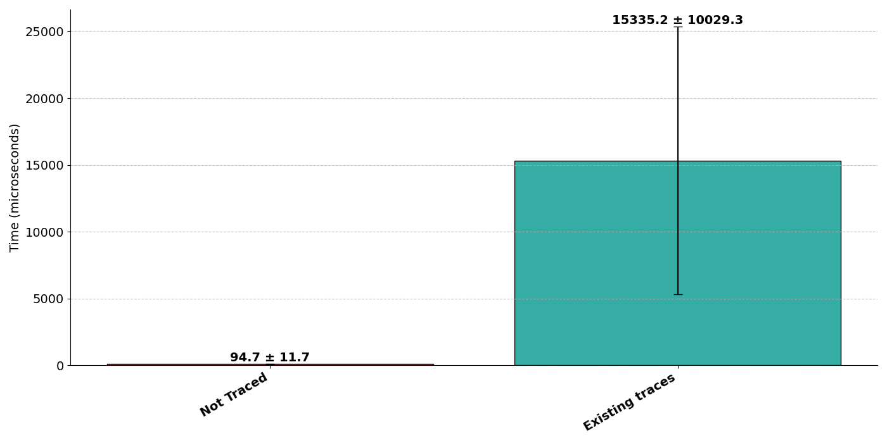
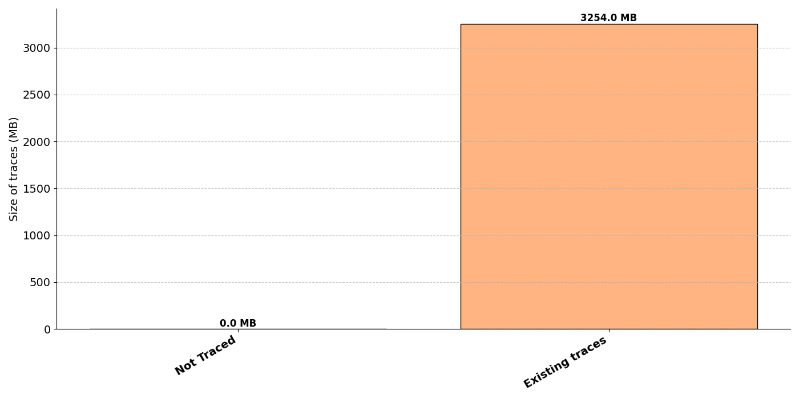

### Classic vs SIFB Only

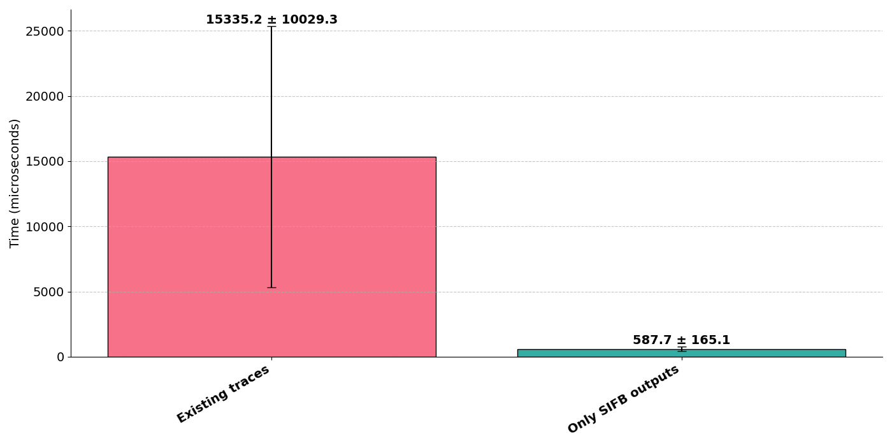
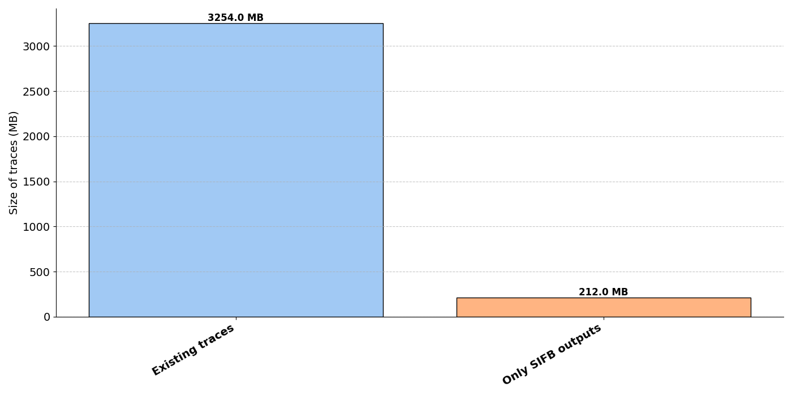

### String vs Binary

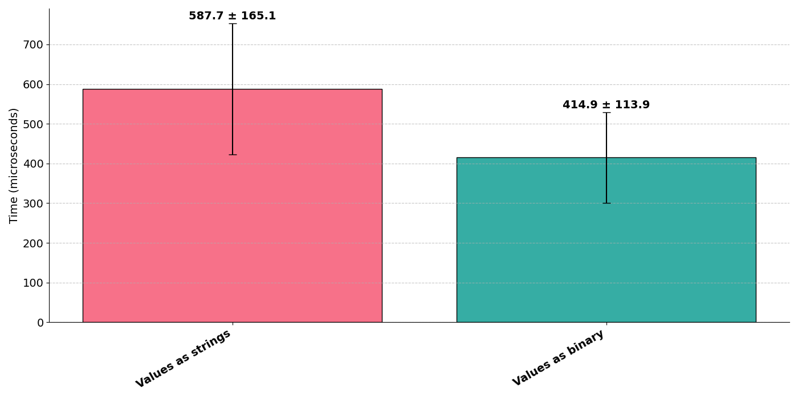
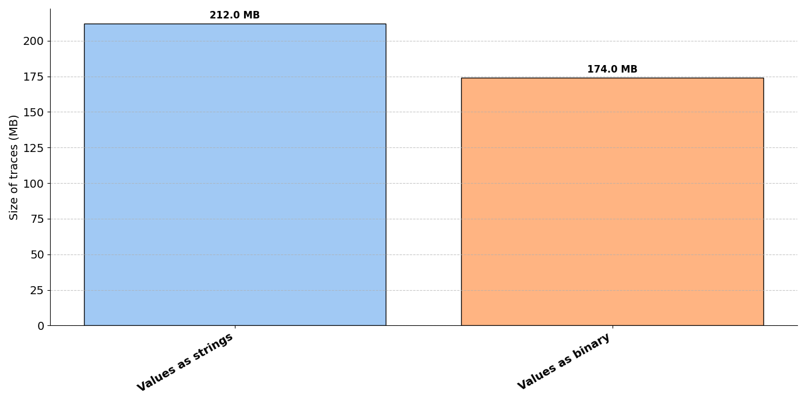

### Binary vs Without clock and type

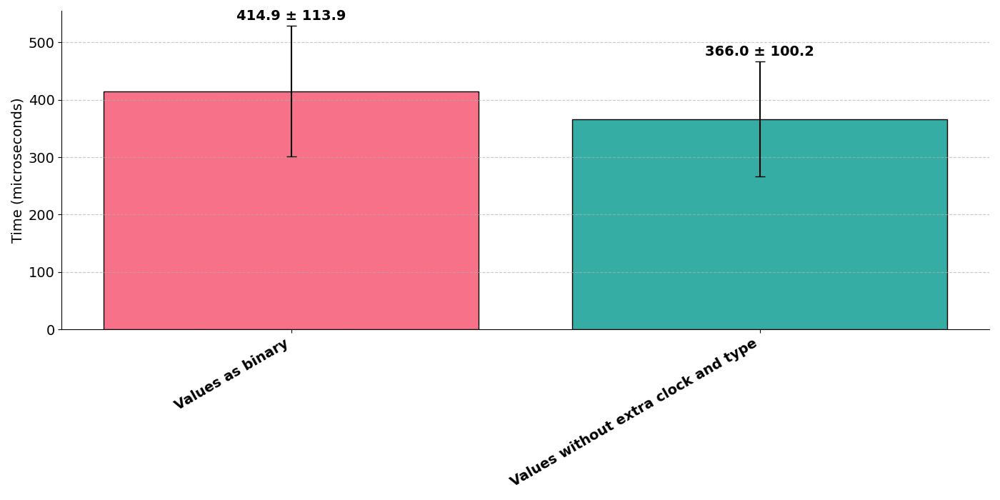
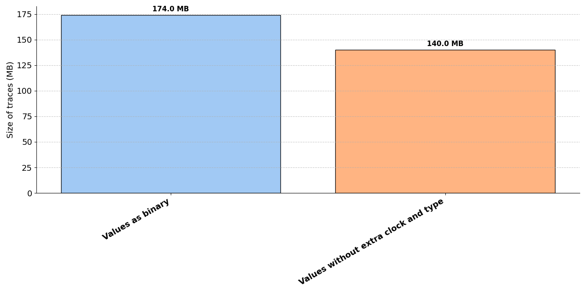

### Without clock and type vs With memory optimizations

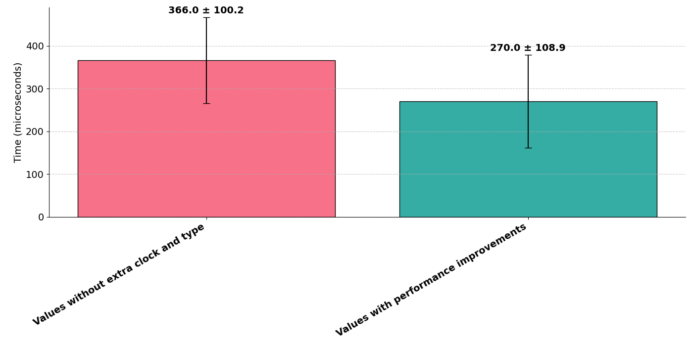
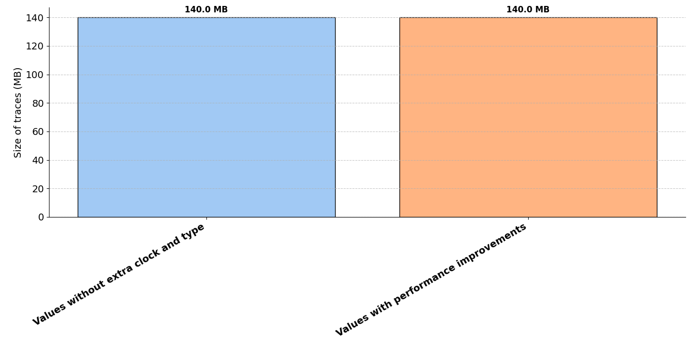

### All configs

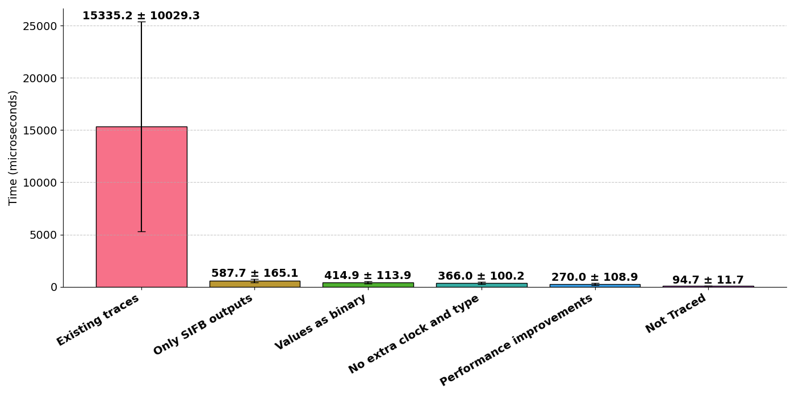
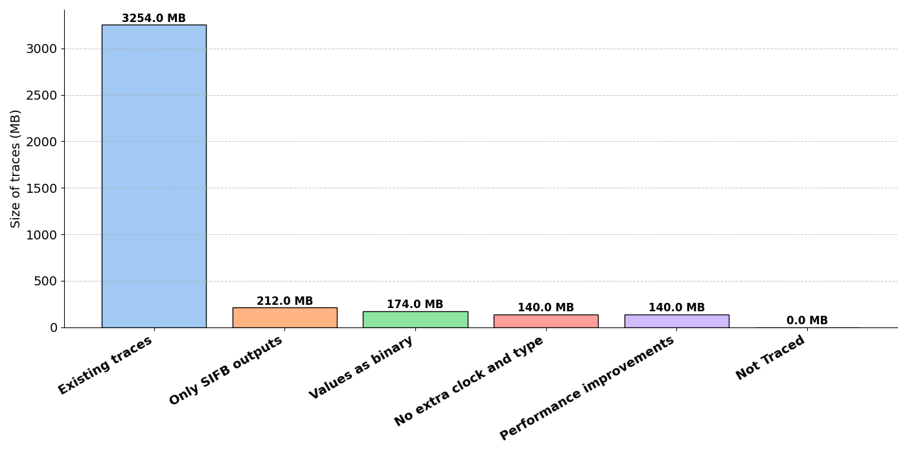

### All configs without classic

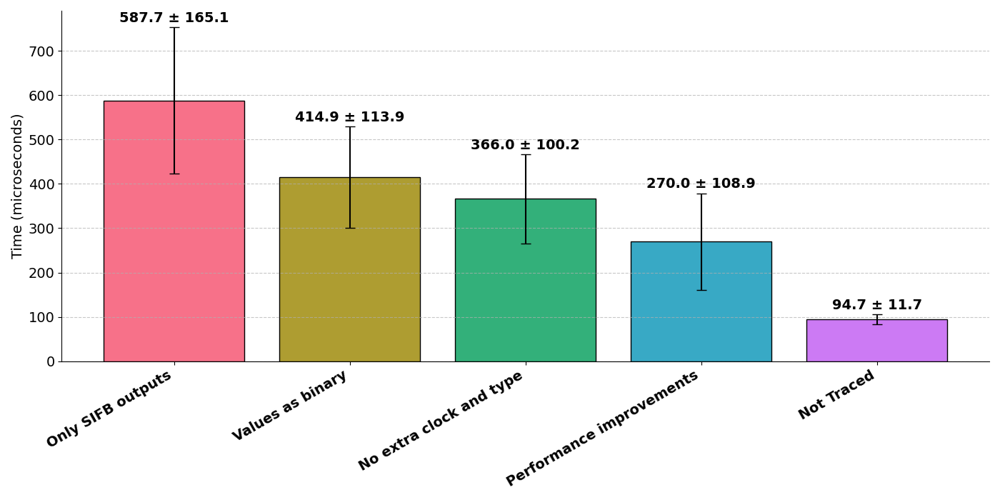
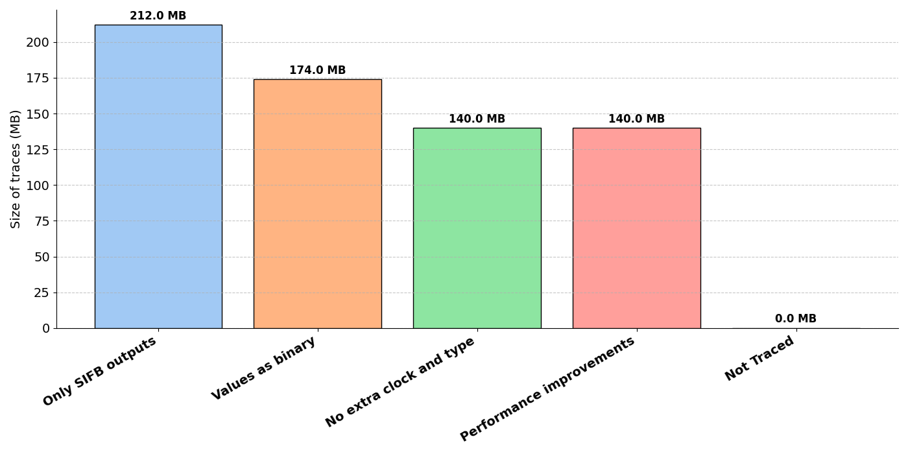

## Scaling

## Increasing amount of FBs

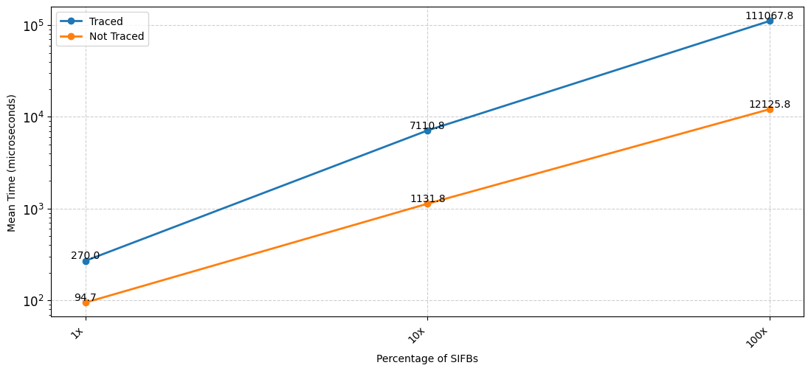
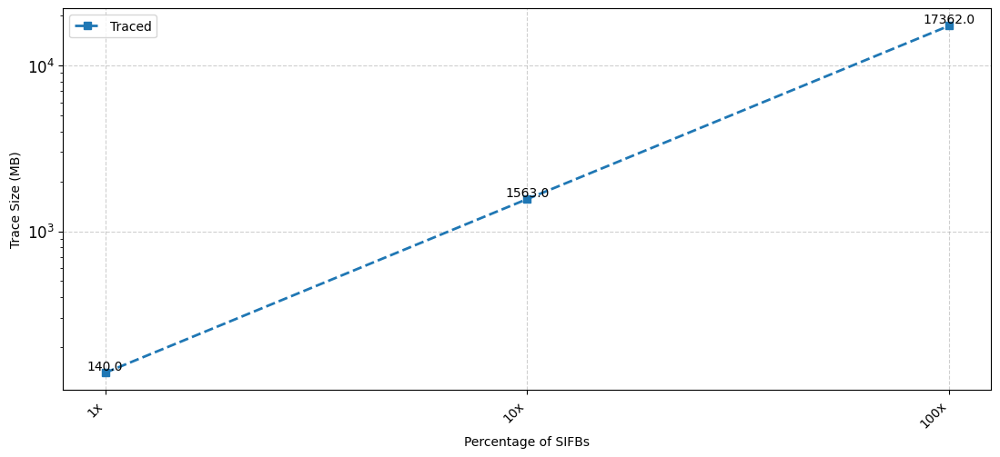

## Scaling SIFBs

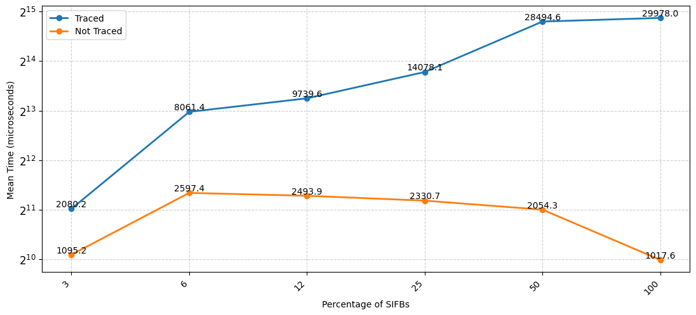


## Scaling Heavier SIFBs

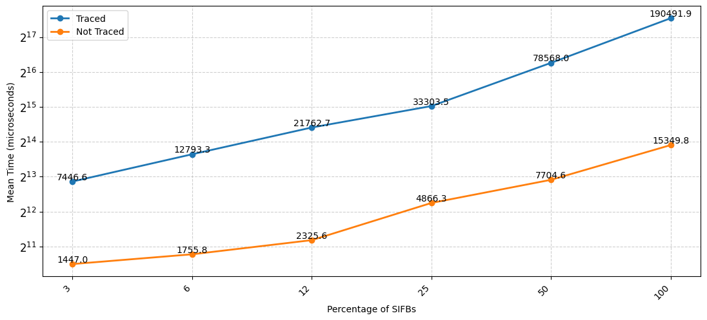
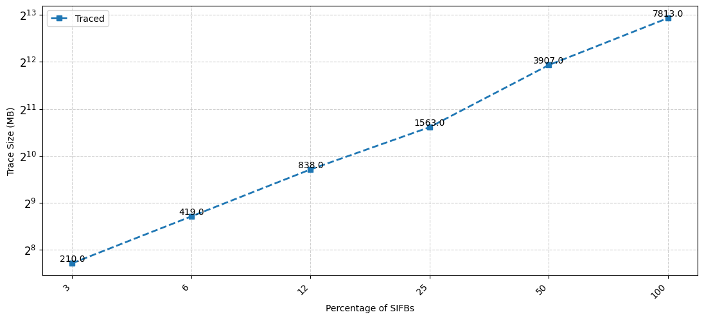
